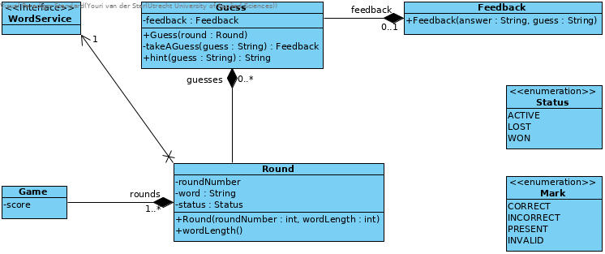

# CISQ1: Lingo Trainer

| **Status** | **Rating** |
|:---|:---|
|  | 
|  | 
|  | 
|  |

## Domainmodel

>   
> Made with Visual Paradigm, project files can be found in the [visualParadigm folder](docs/visualParadigm/) in the docs folder.
